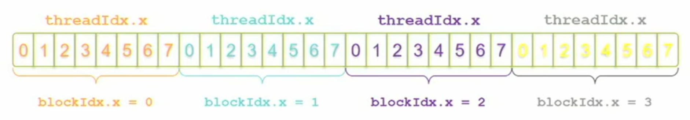
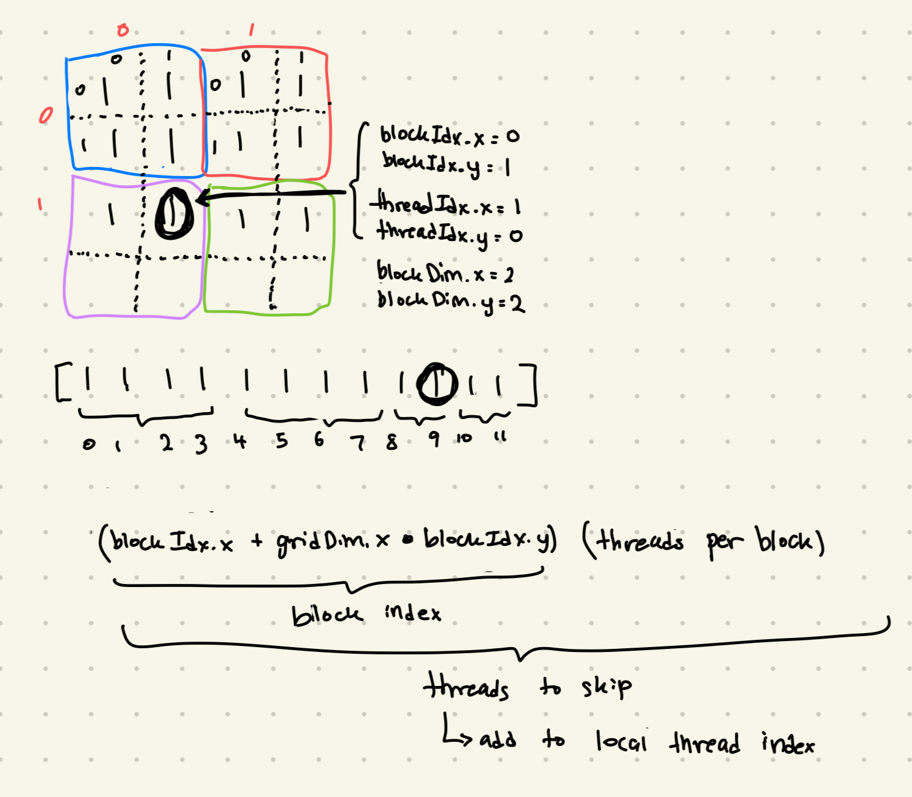

# CUDA Programming

Notes from <https://www.olcf.ornl.gov/cuda-training-series/>, <https://siboehm.com/articles/22/CUDA-MMM>

## Basics

- mark device functions with prefix `__global__`
- device functions take pointers
- launch kernels with `kernel_name<<<parameter1, parameter2>>>`
  - `parameter1` refers to how many "workers" we deploy (otherwise known as blocks)
  - `parameter2` refers to how many threads we deploy in each worker/block


### Vector addition (see `src/math/vec_add.cu`)

simplest kernels:

- `kernel_1<<<N, 1>>>` will...
  - launch N blocks
  - each block runs its own `kernel`, with different values for `blockIdx.x`
    - first block = 0, so `c[0] = a[0] + b[0]`, second block = 1, so `c[1] = a[1] + b[1]`, etc.
- `kernel_2<<<1, N>>>` will...
  - launch 1 block
  - this one block has N threads, where each thread computes one element for `c`

to use multiple blocks AND threads:

- with M threads per block, unique index for each thread given by...

```cpp
int index = threadIdx.x + (blockIdx.x * M);
```

- `kernel_3<<<N / THREADS_PER_BLOCK, THREADS_PER_BLOCK>>>` will...
  - divide work into variable number of blocks (depending on how many threads per block we specify)



- can lend itself to some problems
- namely--if size of vector isn't exactly divisible by number of blocks (`blockDim.x`)?
- need to use minimum number of blocks to fit all elements, but we need to ensure some threads in the last block don't write to segfault locations (imagine graphic above but with last couple of threads in the 4th block being empty)
- can do this by passing size of vector to kernel and ensuring that calculated thread index is always lower than size before doing any writing to output vector (see `kernel_4` in `vec_add.cu`)
- in kernel launch, use integer division to find minimum number of blocks
  - for ex. if `N` = 18 & `threads` = 4, (`N` + `threads` - 1) / `threads` = 5
  - launches 5 blocks with 4 threads each, which is correct minimum value

---

### matrix addition (see `src/math/mat_add.cu`)

- not fundamentally different from vector addition
- we can still use vector addiction, since this is also an elementwise operation
- *don't* represent matrices as actual 2D arrays
  - we want guaranteed contiguous memory
  - use flattened array to represent memory in host
  - but then use actual 2D blocks/grids in device
- use the following formula to calculate index in 2D block

```cpp
int idx = threadIdx.x * blockDim.x + threadIdx.y
```

- `blockDim.x` (or `N` in the code) is also equal to the number of rows in matrix
- this is our row stride--how many elements to skip in  contiguous representation to get to the next row
- we multiply the threadIdx.x by this element to skip to the next row that we want

